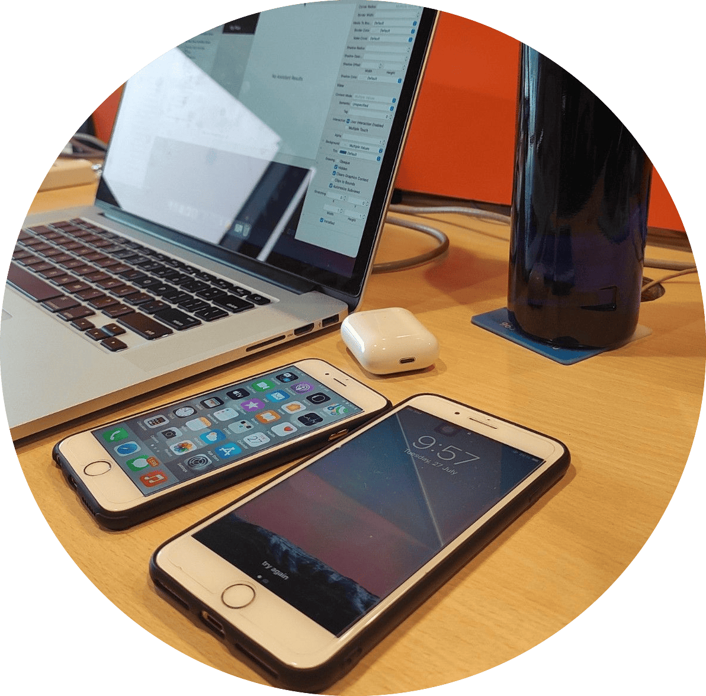

  

👋 Hi, I'm Gaganpreet  
💻 Senior iOS & Flutter Developer (Objective C | Swift | SwiftUI | Flutter)  

*Welcome to my GitHub Profile!*

Self-taught iOS developer with proven expertise in designing, developing, and delivering high-quality mobile applications for iPhone, iPad, Apple Watch, and Android. Skilled in creating intuitive, seamless user experiences through clean, efficient, and maintainable code.  

I welcome opportunities for any collaborations or freelance engagements.  

To explore my projects in detail, visit my <a href="https://codehub97.github.io/gaganpreet/">GitHub Portfolio</a>.

