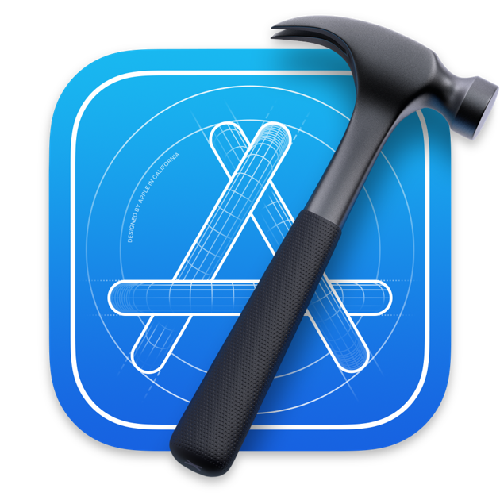

<!-- Centered Welcome Message and Intro -->

  <h1>👋 Hi, I'm Gagan</h1>

<strong>As a developer</strong>

<ul>
  <li>💻 I am working with iOS & Flutter (Objective C | Swift | SwiftUI | Flutter)</li> 
  <li>I welcome opportunities for any collaborations or freelance engagements.</li> 
   <li>
    To explore my projects in detail, visit my <a href="https://codehub97.github.io/gaganpreet/">GitHub Portfolio</a>.
  </li> 
  <li>
    Reach me at: 
    
    
  </li>
 
</ul>

<!-- Languages and Tools Section -->

<strong>Languages and Tools:</strong>

  &nbsp;&nbsp;
  &nbsp;&nbsp;
  &nbsp;&nbsp;
  

